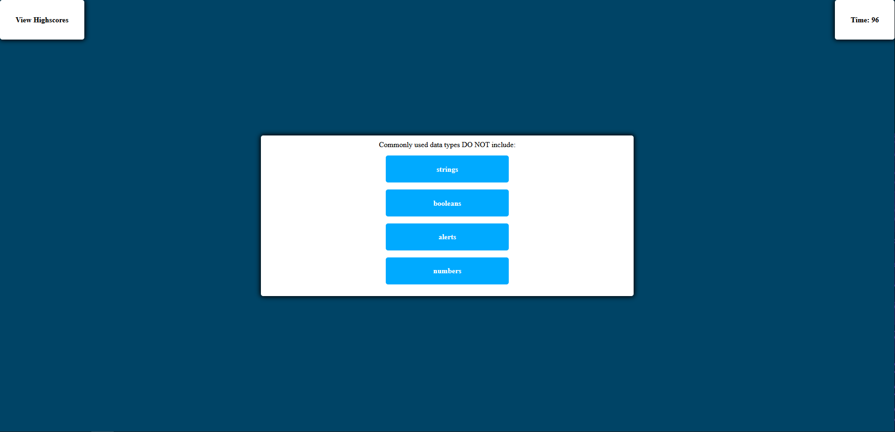

# 04-Coding-Quiz

## Description

A simple coding quiz made using javascipt that can save highscores to local data.

## Assignment

This is the coding quiz assignment by the UCI Full Stack Developer Boot Camp.

Assignment included building a javascript application that quizzes the user on simple coding related concepts with a requirement of highscores being able to be saved to local storage.

## Image

## Destination

Url Published at: https://omarace.github.io/04-Coding-Quiz/